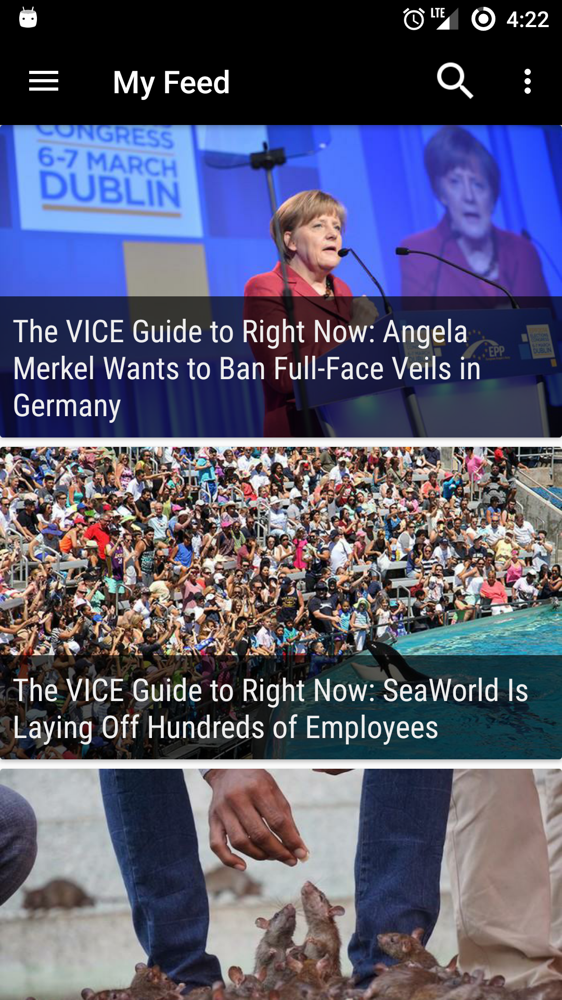
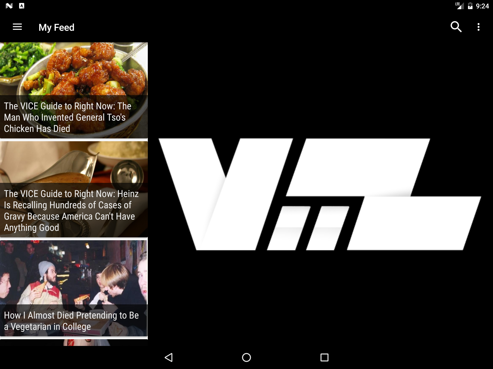
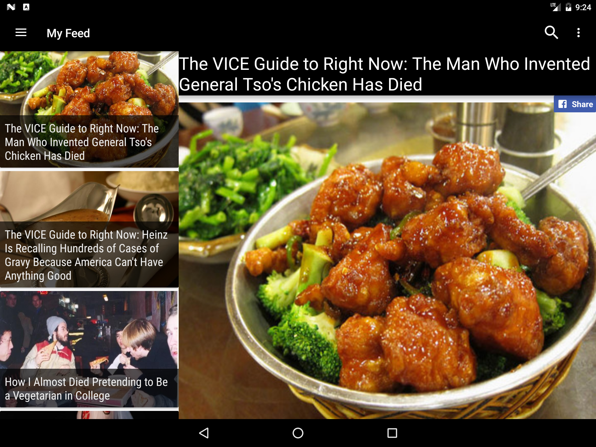

#  Welcome to VooZ
###### By Yuan Xue Lim, Colin Bradley, Kenny Korb and David Scarimbolo

## Introduction

VooZ is a simple to use news app that utilizes Vice API to create a visually appealing app. Users can select their topic of interest and VooZ will create a customize the feed to best suit them. VooZ also parses thru the body of the articles, which was represented in html, and extract important informations to be presented in a cleanly formatted article.

---
## Research and Planning

Before we started creating the app, we did an extensive research on our user base to determine what is the best features to be included into our app.

In our [interviews](Research:Planning/Interviews.txt) that we've conducted, we can safely conclude that our users has many similarities with [the user persona of Bob](Research:Planning/Bob.jpg). They are generally in the 30's who are mostly male with left leaning political view.

Afterward, we did some [research on our competitors](Research:Planning/Competitor Research.pdf) and found that our major competitors are the guardian, FlipBoard, Buzzfeed and Huffington Post. Most of the the articles that they push out doesn't have too much content or the image to text ratio are out of proportion. Most of our competitors doesn't allow users to customize their news feed to their own needs. And worst of all, they all contains ads, which for most users are annoying.

After concluding our research, we come up with the following features that tailors to our users. 

---
## Features
### Welcome Page

The first time you open your app, you are greeted with a welcome page that will guide you through setting up the app for the best experience possible.

### Topic section

Select a topic from a side bar to dive deep into the topic.

### Personal Feed

Upon completing the welcome page, the app brings you directly to a list of articles that matches the favorite topics you've picked.

### HTML Parsing in Detail Page

Upon selecting an article, the app will bring up a detail page of the article that will fetch all of the elements in the articles, including images and youtube video, displayed in the way it looks on Vice official website.

### Custom Notification

When you set up for notification, the app will notify you with with new articles from your favorite topics on the time and day you selected.

### Tablet

### Facebook Share

You can also easily share this article to Facebook with just a click of a button.

## Other features:

- Video Playback
- Swipe down to refresh
- Auto scroll to top
- Database to store user's favorite topics and time of notification
- Network Change Notification
- Animation
- Endless Scroll
